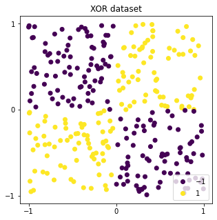
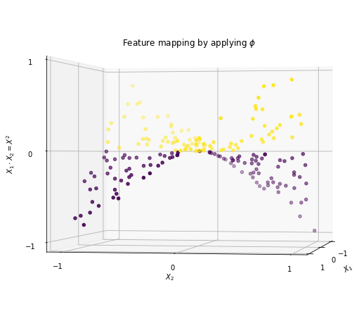
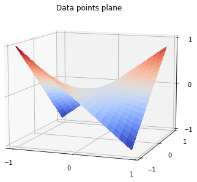
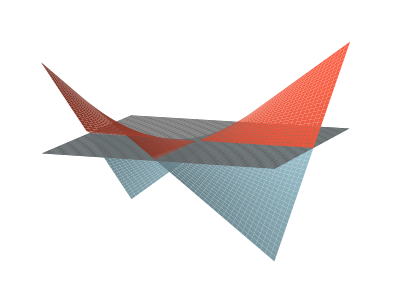

<h1 align="center">Solving datasets with linearly nonseparable clusters with feature mapping</h1>

## Description and Idea
In a previously created Repository, I made a very simple neural network without a hidden layer to solve an easy classification problem. It could only classify clusters if they were seperable by a line. So I thought I need to add hidden layers to solve any problems that are more complicated like the XOR dataset. But after some research I discovered feature mapping which is widely used in convolutional neural networks (cnn) which are used for instance for image classification. Feature mapping in cnn's is very sophisticated and I will not start at such a high level yet. But there is a simple way to implement feature mapping and solve the XOR dataset with the simple neural network which learns $w \in \mathbb{R}^2$ and $b \in \mathbb{R}$ in $y_{w,b}(X) = w \cdot X + b$ with $X \in \mathbb{R}^2$. And that is to add a function $\phi : \mathbb{R}^2 \rightarrow \mathbb{R}^d$. We do this by taking a look at the data and choose $\phi$ and $d$ accordingly. To do all this we will use numpy, matplotlib for the plots and some math only.

## Looking at the Data

First as always
``` bash
import numpy as np
import matplotlib.pyplot as plt
```

then we generate the XOR data

``` bash
def xor_data(n):
    X = np.random.uniform(low=-1, high=1, size=(n,2))
    y = np.bitwise_xor(np.sign(X[:,0]).astype(int), np.sign(X[:,1]).astype(int))+1
    return X, y

np.random.seed(123) 

X_train, y_train = generate_data(200)
X_test, y_test = generate_data(100)

fig, ax = plt.subplots(figsize=(5, 5))
scatter = ax.scatter(X_train[:,0], X_train[:,1], c=y_train)
ax.scatter(X_test[:,0], X_test[:,1], c=y_test)
ax.legend(*scatter.legend_elements(), loc=4)

plt.show()
```
<p align="center"> 
    
</p>

Notice that points $(x_1, x_2)$ and $(-x_1, -x_2)$ have the same label $1$ while $(-x_1, x_2)$ and $(x_1, -x_2)$ share label $-1$. The idea behind feature mapping is to use this information to get some new information. E.g. if we multiply corresponding $x_1$ and $x_2$ values we get for $(x_1, x_2) \Rightarrow x_1 \cdot x_2 = +x_{1,2} $ and for $(-x_1, -x_2) \Rightarrow -x_1 \cdot -x_2 = +x_{1,2} $. Always positive values! For $(-x_1, x_2)$ and $(x_1, -x_2)$ we would always get negative values because $+ \cdot - = - $ and $- \cdot + = - $. Remember, $X$ is a matrix in $\mathbb{R}^2$ and therefore we add a third row to the matrix that has the product of the values from the first two rows. Therefore we choose d to be 3 and make $X \in \mathbb{R}^3$.

Let's put this into python code. We add (here called concatenate) a third row to the original matrix. The third row is the product of the two rows before it.
``` bash
def phi(X):
    return np.concatenate([X, X.prod(1, keepdims=True)], axis=1)
```
Now we have 3 dimensions we can plot if we use $\phi$ on the X_train data.

<p align="center"> 
    
</p>

To have a better view of how the feature mapping impacts the data points let's look at a mesh grid plane:

<p align="center"> 
    
</p>

It's shaped like a pringels chip thus allowing us to linearly separate it. The network would do this by learning the right w and b to find a plane that separates the positive and negative points. It will idealy find the plane that is the $x_1$-axis and $x_2$-axis plane with $x_3 = 0$ like this

<p align="center"> 
    
</p>
