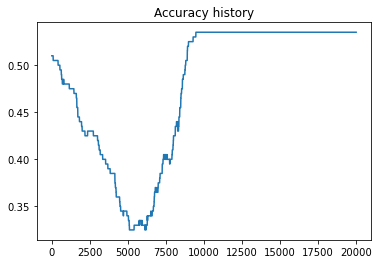

<h1 align="center">Classifying linearly nonseparable clusters with feature mapping</h1>

## Description and Idea
In a previously created Repository, I made a very simple neural network without a hidden layer to solve an easy classification problem. It could only classify clusters if they were seperable by a line. So I thought I need to add hidden layers to solve any problems that are more complicated like the XOR dataset. But after some research I discovered feature mapping which is widely used in convolutional neural networks (cnn) that are used for instance for image classification. Feature mapping in cnn's is very sophisticated and I will not start at such a high level yet. I will explore the possibilities of feature mapping to add inputs to a neural network, a couple applications on toy data and I will talk about the limitations as well.
<br>First of all, what is feature mapping? Features in a neural network are the variables or attributes in your data set. You usually pick a subset of variables that can be used as good predictors by your model. So in a neural network, the features would be the input layer, not the hidden layer nodes. Mapping just means to use a function that expands or shrinks the space the features live in. The so called feature space. There is a simple way to implement feature mapping and solve the XOR dataset with the simple neural network which learns $w \in \mathbb{R}^2$ and $b \in \mathbb{R}$ in $y_{w,b}(X) = w \cdot X + b$ with $X \in \mathbb{R}^2$. Like I explained before we first define a function $\phi : \mathbb{R}^2 \rightarrow \mathbb{R}^d$. We do this by taking a look at the data and choose $\phi$ and $d$ accordingly. Then we apply the feature mapping function $\phi$ on our training data and let the neural network model run. We will use numpy, matplotlib for the plots and some math.

## Looking at the Data
First we generate the XOR data

```bash
import numpy as np
import matplotlib.pyplot as plt

def xor_data(n):
    X = np.random.uniform(low=-1, high=1, size=(n,2))
    y = np.bitwise_xor(np.sign(X[:,0]).astype(int), np.sign(X[:,1]).astype(int))+1
    return X, y

np.random.seed(123) 

X_train, y_train = generate_data(200)
X_test, y_test = generate_data(100)

fig, ax = plt.subplots(figsize=(5, 5))
scatter = ax.scatter(X_train[:,0], X_train[:,1], c=y_train)
ax.scatter(X_test[:,0], X_test[:,1], c=y_test)
ax.legend(*scatter.legend_elements(), loc=4)

plt.show()
```
<p align="center"> 
    
</p>

## Finding a feature mapping for this data

Notice that points $(x_1, x_2)$ and $(-x_1, -x_2)$ have the same label $1$ while $(-x_1, x_2)$ and $(x_1, -x_2)$ share label $-1$. The idea behind feature mapping is to use this information to get some new information. E.g. if we multiply corresponding $x_1$ and $x_2$ values we get for $(x_1, x_2) \Rightarrow x_1 \cdot x_2 = +x_{1,2} $ and for $(-x_1, -x_2) \Rightarrow -x_1 \cdot -x_2 = +x_{1,2} $. Always positive values! For $(-x_1, x_2)$ and $(x_1, -x_2)$ we would always get negative values because $+ \cdot - = - $ and $- \cdot + = - $. Remember, $X$ is a matrix in $\mathbb{R}^2$ and therefore we add a third row to the matrix that has the product of the values from the first two rows. Therefore we choose d to be 3 and make $X \in \mathbb{R}^3$.

Let's put this into python code. We add (here called concatenate) a third row to the original matrix. The third row is the product of the two rows before it.
```bash
def phi(X):
    return np.concatenate([X, X.prod(1, keepdims=True)], axis=1)
```
Now we have 3 dimensions we can plot if we use $\phi$ on the X_train data.

<p align="center"> 
    
</p>

To have a better view of how the feature mapping impacts the data points let's look at a mesh grid plane:

<p align="center"> 
    
</p>

It's shaped like a pringels chip thus allowing us to linearly separate it. The network would do this by learning the right w and b to find a plane that separates the positive and negative points. It will idealy find the plane that is the $x_1$-axis and $x_2$-axis plane with $x_3 = 0$ that separates the red (label 1) and blue (label -1) area. You can see this plane in the following plot

<p align="center"> 
    
</p>

## Adding feature mapping to the simple neural net

First let's have a look at the performance of the model without feature mapping. That way we understand the difference

```bash
np.random.seed(123) 

net = linearNet(2)
net.fit(net, X_train, y_train, epochs=20000, learning_rate=0.1, loss_function=mse, dloss_function=dmse)
```
<p align="center"> 
    
</p>

<p align="center"> 
    
</p>

The loss is close to 1 and the accuracy is only 53%. The accuracy tells us that it is a 53% chance or model predicts the label of a point right. It is as bad at predicting as deciding the label based on a coin flip.

<p align="center"> 
    
</p>

Note: at the beginning it actually went down for many epochs before reaching 50% again. It was doing that to minimize the loss and it tried many epochs to classify the clusters with a line like this:

<p align="center"> 
    
</p>

But then it gave up an just labeled all points as one class. That way the loss could be minimized further and the accuracy went up quickly again before eventually staying around 50%. 
<br>Let's not spend any more time on our failed model. We rather implement $\phi$ into our model. It is as simple as adding it to the class as a function and using it in the _output_ function and when calculating the gradient _grad_w_ in the _grad_ function.

```bash
class linearNet:
    
    def __init__(self, d):
        self.w = np.random.normal(scale = np.sqrt(d), size=(d,1))
        self.b = 0
    
    def phi(self, X):
        return np.concatenate([X, X.prod(1, keepdims=True)], axis=1)

    def output(self, X):
        return self.phi(X) @ self.w + self.b

    def grad(self, X, y_true, dloss_function):
        output = self.output(X)
        y_true = y_true.reshape(-1,1)
        dloss = dloss_function(y_true, output)

        grad_w = (dloss * self.phi(X)).mean(axis=0).reshape(-1,1)
        grad_b = dloss.mean()

        return grad_w, grad_b
    
    def fit(self, X_train, y_train, epochs, learning_rate, loss_function, dloss_function):

        for i in range(epochs):
            grad_w, grad_b = self.grad(X_train, y_train, dloss_function)

            self.w -= learning_rate * grad_w
            self.b -= learning_rate * grad_b
```

Next we run our improved model with 3 input nodes. This is because our data X has 3 dimensions now so we will have 3 input nodes in our input layer. Furthermore our weights vector has to be adjusted to be from dimension 3 as well.

```bash
np.random.seed(123) 

net = linearNet(3)
net.fit(X_train, y_train, epochs=20000, learning_rate=0.1, loss_function=mse, dloss_function=dmse)
```
<p align="center"> 
    
</p>

This is already way better. The loss is 0.4539376487357253

<p align="center"> 
    
</p>

The accuracy is great at 99% also.
<br> All this only because we gave our model another dimension to work with. 

The test data predictions look great as well:
```bash
test_output = net.output(X_test)[:,0]
print("The accuracy on test data is "+str(compute_accuracy(y_test, test_output)*100)+"%")
```
gives 
```bash
The accuracy on test data is 98.0%
```
Now the decision boundary looks almost perfect. It recognized the classes very well but I guess the mistakes (marked with white crosses) come from the problem that there are many values close to the border of the classes in the trainings data. 

<p align="center"> 
    
</p>

Technically it should be able to split the data perfectly but the steps are very short now that we are close to the minimum of our loss function. Maybe running it many more epochs will give a 100% accuracy at least on trainings data. If you want to copy the code and try yourself please do so.

## Feature mapping on circle data

First we plot our data. Therefore I sampled points from a normal distribution. Then I took the second half of all points and _"pushed"_ them by normalization away from the center. In this dataset you can actually regulate the noise so that you can create a nonseparable classification problem if you want to.

```bash
import numpy as np
import matplotlib.pyplot as plt

def normalize(x,axis=None):
    return x / np.sqrt((x*x).sum(axis=axis,keepdims=True))

def circle_data(n=100, d=2, noise=4.0):
    x = np.random.randn(n, d)
    x[n//2:] +=  noise*normalize(x[n//2:], axis=1) 
    
    y = np.ones(n).astype(int)
    y[n//2:] *= -1
    
    return x, y

np.random.seed(123) 

X_train, y_train = circle_data(200)
X_test, y_test = circle_data(100)

plt.figure(figsize=(5,5))
scatter = plt.scatter(X_train[:,0], X_train[:,1], c=y_train)
plt.scatter(X_test[:,0], X_test[:,1], c=y_test)
plt.legend(*scatter.legend_elements(), loc=4)
plt.show()
```
<p align="center"> 
    
</p>

As before the question is "How can we transfrom the points to let us separate them by a plane?" The answer is by taking the squared value of each point. That way our points will be shaped like a bowl in three dimensions. That is because points close to zero will not get much bigger, some get even smaller values. On the other hand points far away from zero get very large and therefore the two clusters will bw separable by a line if viewed from this perspective. That's were we want the plane to go later to have a perfect classification. (Note: if you have similar data but it is not centered at zero you don't need to center it manually. You will likely get a bowl shape but it will be less pronunced and tilted. But you will definetly get a good classification result.)

So let's use $x_1^2$ and $x_2^2$ as our added feature to our Matrix $X$. Then $\phi$ looks like this
```bash
def phi(X):
    return np.concatenate([X, (X[:,0]**2).reshape(-1,1), (X[:,1]**2).reshape(-1,1)], axis=1)
```
and the feature space visualized 

<p align="center"> 
    
</p>

<p align="center"> 
    
</p>
Now you see what I meant when I talked about a _bowl_ shape
<p align="center"> 
    
</p>
The neural net should learn this plane in the best case:
<p align="center"> 
    
</p>

Let's run the code in which I only changed $\phi$ and the input nodes to four because we have 4 features $(x_1, x_2, x_1^2, x_2^2)$ in our matrix $X$.

```bash
class linearNet:
    
    def __init__(self, d):
        self.w = np.random.normal(scale = np.sqrt(d), size=(d,1))
        self.b = 0
    
    def phi(self, X):
        return np.concatenate([X, (X[:,0]**2).reshape(-1,1), (X[:,1]**2).reshape(-1,1)], axis=1)

    def output(self, X):
        return self.phi(X) @ self.w + self.b

    def grad(self, X, y_true, dloss_function):
        output = self.output(X)
        y_true = y_true.reshape(-1,1)
        dloss = dloss_function(y_true, output)

        grad_w = (dloss * self.phi(X)).mean(axis=0).reshape(-1,1)
        grad_b = dloss.mean()

        return grad_w, grad_b
    
    def fit(self, X_train, y_train, epochs, learning_rate, loss_function, dloss_function):

        for i in range(epochs):
            grad_w, grad_b = self.grad(X_train, y_train, dloss_function)

            self.w -= learning_rate * grad_w
            self.b -= learning_rate * grad_b


np.random.seed(123) 

net = linearNet(4)
net.fit(X_train, y_train, epochs=2000, learning_rate=0.1, loss_function=mse, dloss_function=dmse)
```
<p align="center"> 
    
</p>
```bash
Most recent loss is 0.18935173340575734
```
<p align="center"> 
    
</p>
```bash
Most recent accuracy is 100%
```
Those values are extremely good and only possible because we designed the data to be classified very easily.
<br>Lastly we look at the decision boundary on training data 

<p align="center"> 
    
</p>

and on test data
<p align="center"> 
    
</p>
```bash
The accuracy on test data is 100%
```
Great results and only because we used some simple input transformation.

I hope this was very informative and maybe you will use more features in you input layer to enhance performance the next time you build a neural network. Check out my last repo on how to build the simple neural network from scratch that I used here.
